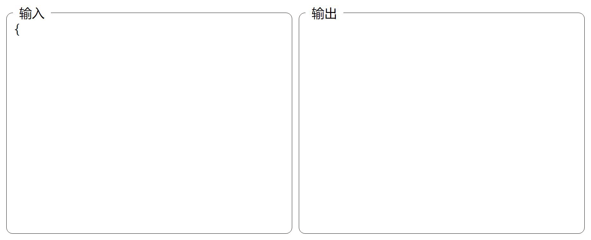

# JsonBrook



> 流式解析Json数据
> 实现上参考了[json-to-ast](https://github.com/vtrushin/json-to-ast)

## 快速入门

```typescript
import { createJsonBrook } from "json-brook";

const jsonBrook = createJsonBrook();

const sample = `{
  "string": "welcome to json brook",
  "number": 20241102,
  "boolean": true,
  "array": ["a", "b", "c"],
  "null": null
}`;

for (const char of sample) {
  jsonBrook.write(char);
  console.log(jsonBrook.getCurrent());
}

jsonBrook.end();
console.log(jsonBrook.getCurrent());
```
